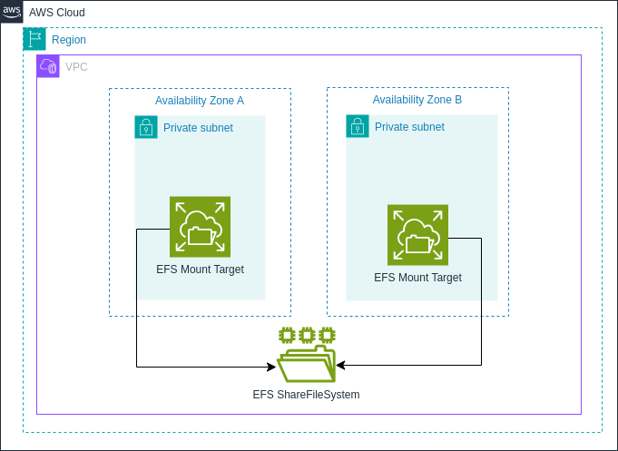

# **Módulo Terraform: cloudops-ref-repo-aws-efs-terraform**

## Descripción:

Este módulo facilita la creación y gestión de recursos de Amazon Elastic File System (EFS) en AWS con todas las mejores prácticas de seguridad, nomenclatura y configuración según los estándares. Permite crear sistemas de archivos EFS con cifrado obligatorio, puntos de acceso personalizados, configuraciones de rendimiento, políticas de ciclo de vida, backup automático y políticas de recursos.

Consulta CHANGELOG.md para la lista de cambios de cada versión. *Recomendamos encarecidamente que en tu código fijes la versión exacta que estás utilizando para que tu infraestructura permanezca estable y actualices las versiones de manera sistemática para evitar sorpresas.*

## Arquitectura



## Características

- ✅ Creación de múltiples sistemas de archivos EFS usando mapas de objetos
- ✅ Soporte para puntos de acceso EFS con configuraciones personalizadas
- ✅ Cifrado obligatorio mediante AWS KMS (clave predeterminada o personalizada)
- ✅ Configuración de puntos de montaje en múltiples subredes para alta disponibilidad
- ✅ Integración con grupos de seguridad para control de acceso
- ✅ Configuración de modos de rendimiento (generalPurpose/maxIO) y rendimiento (bursting/provisioned)
- ✅ Políticas de ciclo de vida para gestión automática del almacenamiento
- ✅ Backup automático integrado con AWS Backup
- ✅ Políticas de recursos para control de acceso granular
- ✅ Etiquetado consistente según estándares organizacionales
- ✅ Validaciones de entrada para prevenir configuraciones incorrectas

## Estructura del Módulo
El módulo cuenta con la siguiente estructura:

```bash
cloudops-ref-repo-aws-efs-terraform/
└── sample/
    ├── data.tf
    ├── main.tf
    ├── outputs.tf
    ├── providers.tf
    ├── terraform.auto.tfvars
    └── variables.tf
├── .gitignore
├── CHANGELOG.md
├── data.tf
├── main.tf
├── outputs.tf
├── providers.tf
├── README.md
├── variables.tf
```

- Los archivos principales del módulo (`data.tf`, `main.tf`, `outputs.tf`, `variables.tf`, `providers.tf`) se encuentran en el directorio raíz.
- `CHANGELOG.md` y `README.md` también están en el directorio raíz para fácil acceso.
- La carpeta `sample/` contiene un ejemplo de implementación del módulo.

## Provider Configuration

Este módulo requiere la configuración de un provider específico para el proyecto. Debe configurarse de la siguiente manera:

```hcl
# sample/providers.tf
provider "aws" {
  alias   = "principal"
  region  = var.aws_region
  profile = var.profile
  
  default_tags {
    tags = var.common_tags
  }
}

# sample/main.tf
module "efs" {
  source = "../"
  providers = {
    aws.project = aws.principal
  }
  # ... resto de la configuración
}
```

## Uso del Módulo:

```hcl
module "efs" {
  source = "ruta/al/modulo"
  
  providers = {
    aws.project = aws.principal
  }

  # Common configuration
  client      = "pragma"
  project     = "idp"
  environment = "dev"
  additional_tags = {
    backup-policy = "daily"
    service-tier  = "standard"
  }

  # Configuración de EFS
  efs_config = {
    "app1" = {
      description     = "EFS para la aplicación 1"
      kms_key_id      = ""  # Usar la clave predeterminada
      subnet_ids      = ["subnet-12345", "subnet-67890"]  # Múltiples subredes para alta disponibilidad
      security_groups = ["sg-12345"]
      
      # Configuraciones de rendimiento y almacenamiento
      performance_mode = "generalPurpose"  # generalPurpose o maxIO
      throughput_mode  = "bursting"        # bursting o provisioned
      
      # Políticas de ciclo de vida
      lifecycle_policy = [
        {
          transition_to_ia = "AFTER_30_DAYS"  # Mover datos no accedidos a almacenamiento IA después de 30 días
        }
      ]
      
      # Configuración de backup
      enable_backup = true
      backup_policy = {
        schedule           = "cron(0 1 * * ? *)"  # Diariamente a la 1 AM
        retention_in_days  = 30                   # Retención por 30 días
      }
      
      # Política de recursos EFS
      resource_policy = <<EOF
{
  "Version": "2012-10-17",
  "Statement": [
    {
      "Effect": "Allow",
      "Principal": {
        "AWS": "arn:aws:iam::123456789012:root"
      },
      "Action": [
        "elasticfilesystem:ClientMount",
        "elasticfilesystem:ClientWrite"
      ],
      "Resource": "*"
    }
  ]
}
EOF
      
      access_points = [
        {
          name        = "ap1"
          path        = "/path1"
          owner_gid   = 1001
          owner_uid   = 1001
          permissions = 755
          posix_user = {
            gid = 1001
            uid = 1001
          }
        }
      ]
      additional_tags = {
        application = "app1"
        data-classification = "internal"
      }
    }
  }
}
```

## Convenciones de nomenclatura

El módulo sigue un estándar de nomenclatura para los recursos:

```
{client}-{project}-{environment}-efs-{efs_name}
{client}-{project}-{environment}-efs-ap-{efs_name}-{access_point_name}
{client}-{project}-{environment}-backup-vault-efs
{client}-{project}-{environment}-backup-plan-efs-{efs_name}
```

Por ejemplo:
- `pragma-idp-dev-efs-app1`
- `pragma-idp-dev-efs-ap-app1-ap1`
- `pragma-idp-dev-backup-vault-efs`
- `pragma-idp-dev-backup-plan-efs-app1`

## Etiquetado

El módulo maneja el etiquetado de la siguiente manera:

1. **Etiquetas obligatorias**: Se aplican a través del provider AWS usando `default_tags` en la configuración del provider.
   ```hcl
   provider "aws" {
     default_tags {
       tags = {
         environment = "dev"
         project-name = "idp"
         cost-center = "cloud-ops"
         owner = "cloudops"
         area = "infrastructure"
         provisioned = "terraform"
         datatype = "operational"
       }
     }
   }
   ```

2. **Etiqueta Name**: Se genera automáticamente siguiendo el estándar de nomenclatura para cada recurso.

3. **Etiquetas adicionales por recurso**: Se pueden especificar etiquetas adicionales para cada EFS individualmente mediante el atributo `additional_tags` en la configuración de cada EFS.

## Requirements

| Name | Version |
|------|---------|
| <a name="requirement_terraform"></a> [terraform](#requirement\_terraform) | >= 1.0.0 |
| <a name="requirement_aws"></a> [aws](#requirement\_aws) | >= 4.31.0 |

## Providers

| Name | Version |
|------|---------|
| <a name="provider_aws.project"></a> [aws.project](#provider\_aws) | >= 4.31.0 |

## Resources

| Name | Type |
|------|------|
| [aws_efs_file_system](https://registry.terraform.io/providers/hashicorp/aws/latest/docs/resources/efs_file_system) | resource |
| [aws_efs_mount_target](https://registry.terraform.io/providers/hashicorp/aws/latest/docs/resources/efs_mount_target) | resource |
| [aws_efs_access_point](https://registry.terraform.io/providers/hashicorp/aws/latest/docs/resources/efs_access_point) | resource |
| [aws_efs_file_system_policy](https://registry.terraform.io/providers/hashicorp/aws/latest/docs/resources/efs_file_system_policy) | resource |
| [aws_backup_vault](https://registry.terraform.io/providers/hashicorp/aws/latest/docs/resources/backup_vault) | resource |
| [aws_backup_plan](https://registry.terraform.io/providers/hashicorp/aws/latest/docs/resources/backup_plan) | resource |
| [aws_backup_selection](https://registry.terraform.io/providers/hashicorp/aws/latest/docs/resources/backup_selection) | resource |
| [aws_iam_role](https://registry.terraform.io/providers/hashicorp/aws/latest/docs/resources/iam_role) | resource |
| [aws_iam_role_policy_attachment](https://registry.terraform.io/providers/hashicorp/aws/latest/docs/resources/iam_role_policy_attachment) | resource |

## Variables

| Name | Description | Type | Default | Required |
|------|-------------|------|---------|:--------:|
| <a name="client"></a> [client](#input\client) | Identificador del cliente | `string` | n/a | yes |
| <a name="project"></a> [project](#input\project) | Nombre del proyecto asociado al EFS | `string` | n/a | yes |
| <a name="environment"></a> [environment](#input\environment) | Entorno de despliegue (dev, qa, pdn) | `string` | n/a | yes |
| <a name="additional_tags"></a> [additional_tags](#input\additional_tags) | Etiquetas adicionales para los recursos | `map(string)` | `{}` | no |
| <a name="efs_config"></a> [efs_config](#input\efs_config) | Configuración de sistemas de archivos EFS | `map(object)` | n/a | yes |

### Estructura de `efs_config`

```hcl
variable "efs_config" {
  type = map(object({
    description      = string
    kms_key_id       = string  # Si está vacío, se configura aws/elasticfilesystem
    subnet_ids       = list(string)  # Lista de subredes para puntos de montaje
    security_groups  = list(string)
    
    # Configuraciones de rendimiento y almacenamiento
    performance_mode = optional(string, "generalPurpose")  # generalPurpose o maxIO
    throughput_mode  = optional(string, "bursting")        # bursting o provisioned
    provisioned_throughput_in_mibps = optional(number, null) # Requerido si throughput_mode = "provisioned"
    
    # Políticas de ciclo de vida
    lifecycle_policy = optional(list(object({
      transition_to_ia                    = optional(string) # AFTER_7_DAYS, AFTER_14_DAYS, AFTER_30_DAYS, AFTER_60_DAYS, AFTER_90_DAYS
      transition_to_primary_storage_class = optional(string) # AFTER_1_ACCESS
    })), [])
    
    # Configuración de backup
    enable_backup = optional(bool, false)
    backup_policy = optional(object({
      schedule           = optional(string, "cron(0 1 * * ? *)")  # Por defecto, diariamente a la 1 AM
      retention_in_days  = optional(number, 30)                   # Retención por defecto: 30 días
    }), null)
    
    # Política de recursos EFS
    resource_policy = optional(string, null)
    
    # Puntos de acceso
    access_points = list(object({
      name        = string
      path        = string
      owner_gid   = number
      owner_uid   = number
      permissions = number
      posix_user = optional(object({
        gid = number
        uid = number
      }))
    }))
    
    additional_tags  = optional(map(string), {})
  }))
}
```

## Outputs

| Name | Description |
|------|-------------|
| <a name="efs_info"></a> [efs_info](#output\efs_info) | Información de los sistemas de archivos EFS creados |
| <a name="access_points"></a> [access_points](#output\access_points) | Información de los puntos de acceso EFS creados |
| <a name="mount_targets"></a> [mount_targets](#output\mount_targets) | Información de los puntos de montaje EFS creados |
| <a name="backup_info"></a> [backup_info](#output\backup_info) | Información de las configuraciones de backup (si están habilitadas) |
| <a name="resource_policies"></a> [resource_policies](#output\resource_policies) | Información de las políticas de recursos EFS (si están configuradas) |

## Escenarios de uso comunes

### 1. EFS para aplicaciones de alta disponibilidad

Para aplicaciones que requieren alta disponibilidad, se recomienda configurar puntos de montaje en múltiples zonas de disponibilidad:

```hcl
efs_config = {
  "app1" = {
    description     = "EFS para aplicación de alta disponibilidad"
    kms_key_id      = ""
    subnet_ids      = ["subnet-az1", "subnet-az2", "subnet-az3"]  # Subredes en diferentes AZs
    security_groups = ["sg-app"]
    # ... resto de la configuración
  }
}
```

### 2. EFS con rendimiento aprovisionado para cargas de trabajo intensivas

Para aplicaciones con altos requisitos de rendimiento:

```hcl
efs_config = {
  "database" = {
    description     = "EFS para base de datos con alto rendimiento"
    kms_key_id      = ""
    subnet_ids      = ["subnet-app"]
    security_groups = ["sg-db"]
    performance_mode = "maxIO"
    throughput_mode  = "provisioned"
    provisioned_throughput_in_mibps = 256  # 256 MiB/s de rendimiento
    # ... resto de la configuración
  }
}
```

### 3. EFS con políticas de ciclo de vida para optimización de costos

Para optimizar costos moviendo datos poco utilizados a almacenamiento de acceso infrecuente:

```hcl
efs_config = {
  "archivos" = {
    description     = "EFS para archivos con optimización de costos"
    kms_key_id      = ""
    subnet_ids      = ["subnet-app"]
    security_groups = ["sg-app"]
    lifecycle_policy = [
      {
        transition_to_ia = "AFTER_30_DAYS"  # Mover a IA después de 30 días
      },
      {
        transition_to_primary_storage_class = "AFTER_1_ACCESS"  # Volver a estándar después de acceso
      }
    ]
    # ... resto de la configuración
  }
}
```

### 4. EFS con backup automático para protección de datos

Para proteger datos críticos con copias de seguridad automáticas:

```hcl
efs_config = {
  "datos-criticos" = {
    description     = "EFS para datos críticos con backup"
    kms_key_id      = ""
    subnet_ids      = ["subnet-app"]
    security_groups = ["sg-app"]
    enable_backup = true
    backup_policy = {
      schedule           = "cron(0 1 * * ? *)"  # Diariamente a la 1 AM
      retention_in_days  = 90                   # Retención por 90 días
    }
    # ... resto de la configuración
  }
}
```

### 5. EFS con políticas de recursos para control de acceso granular

Para implementar control de acceso granular a nivel de servicio:

```hcl
efs_config = {
  "datos-compartidos" = {
    description     = "EFS con política de recursos para acceso compartido"
    kms_key_id      = ""
    subnet_ids      = ["subnet-app"]
    security_groups = ["sg-app"]
    resource_policy = <<EOF
{
  "Version": "2012-10-17",
  "Statement": [
    {
      "Effect": "Allow",
      "Principal": {
        "AWS": "arn:aws:iam::123456789012:role/AppRole"
      },
      "Action": [
        "elasticfilesystem:ClientMount"
      ],
      "Resource": "*",
      "Condition": {
        "Bool": {
          "aws:SecureTransport": "true"
        }
      }
    }
  ]
}
EOF
    # ... resto de la configuración
  }
}
```

## Consideraciones de rendimiento

Amazon EFS ofrece dos modos de rendimiento:

1. **Modo de propósito general (generalPurpose)**: Adecuado para la mayoría de las cargas de trabajo. Este es el modo predeterminado. Ofrece latencias más bajas pero menor capacidad de operaciones por segundo.

2. **Modo de E/S máxima (maxIO)**: Optimizado para aplicaciones que requieren mayor capacidad de operaciones por segundo, a costa de latencias ligeramente más altas.

Y dos modos de rendimiento:

1. **Rendimiento aprovisionado (provisioned)**: Permite especificar el rendimiento independientemente del tamaño del almacenamiento. Útil para cargas de trabajo con requisitos de rendimiento predecibles.

2. **Rendimiento en ráfagas (bursting)**: El rendimiento escala con el tamaño del sistema de archivos. Adecuado para cargas de trabajo variables.

### Recomendaciones de rendimiento:

| Tipo de carga de trabajo | Performance Mode | Throughput Mode | Notas |
|--------------------------|------------------|----------------|-------|
| Uso general | generalPurpose | bursting | Adecuado para la mayoría de los casos de uso |
| Bases de datos | generalPurpose | provisioned | Proporciona latencia baja y rendimiento consistente |
| Big Data/Análisis | maxIO | provisioned | Optimizado para alto rendimiento con muchos clientes |
| Desarrollo/Pruebas | generalPurpose | bursting | Económico para entornos no productivos |
| Contenido web | generalPurpose | bursting | Buen rendimiento para servir contenido |

## Consideraciones de seguridad

- El cifrado en reposo está habilitado por defecto y es obligatorio
- Configure grupos de seguridad restrictivos para limitar el acceso a los puntos de montaje EFS
- Utilice puntos de acceso con permisos POSIX adecuados para limitar el acceso a nivel de sistema de archivos
- Implemente políticas de recursos para control de acceso granular
- Habilite el backup automático para datos críticos
- Considere implementar políticas de IAM adicionales para restringir aún más el acceso

## Mejores Prácticas Implementadas

- **Seguridad**: Cifrado en reposo obligatorio con AWS KMS
- **Alta disponibilidad**: Soporte para puntos de montaje en múltiples zonas de disponibilidad
- **Optimización de costos**: Políticas de ciclo de vida para gestión automática del almacenamiento
- **Protección de datos**: Integración con AWS Backup para copias de seguridad automáticas
- **Control de acceso**: Políticas de recursos para control de acceso granular
- **Nomenclatura**: Estándar {client}-{project}-{environment}-efs-{efs_name}
- **Etiquetado**: Etiquetas completas según política (environment, project, owner, client) a través de `default_tags`
- **Modularización**: Estructura modular y reutilizable
- **Validaciones**: Validaciones para garantizar configuraciones correctas

## Configuración del Backend

> **Recomendación importante**: Para entornos de producción y colaboración en equipo, se recomienda configurar un backend remoto para almacenar el estado de Terraform (tfstate). Esto proporciona:
>
> - Bloqueo de estado para prevenir operaciones concurrentes
> - Respaldo y versionado del estado
> - Almacenamiento seguro de información sensible
> - Colaboración en equipo
>
> Ejemplo de configuración con S3 y DynamoDB:
>
> ```hcl
> terraform {
>   backend "s3" {
>     bucket         = "pragma-terraform-states"
>     key            = "efs/terraform.tfstate"
>     region         = "us-east-1"
>     encrypt        = true
>     dynamodb_table = "terraform-locks"
>   }
> }
> ```
>
> Asegúrese de que el bucket S3 tenga el versionado habilitado y que la tabla DynamoDB tenga una clave primaria llamada `LockID`.

## Análisis de Seguridad

Este módulo ha sido analizado con [KICS (Keeping Infrastructure as Code Secure)](https://kics.io/) para detectar posibles vulnerabilidades y problemas de seguridad.

### Resultados del último escaneo

[](./security-reports/results.html)

Puedes ver el reporte completo de seguridad en formato HTML [aquí](./security-reports/results.html) o consultar el [resumen detallado en formato Markdown](./security-reports/SECURITY-REPORT.md).

#### Resumen de hallazgos

| Severidad | Cantidad |
|-----------|----------|
| Alto      | 0        |
| Medio     | 0        |
| Bajo      | 1        |
| Info      | 0        |

El único hallazgo de severidad baja está relacionado con "IAM Access Analyzer Not Enabled", lo cual es esperado ya que este módulo no tiene como objetivo configurar IAM Access Analyzer.


## Lista de verificación de cumplimiento

- [x] Nomenclatura de recursos conforme al estándar
- [x] Etiquetas obligatorias aplicadas a todos los recursos
- [x] Cifrado en reposo obligatorio
- [x] Validaciones para garantizar configuraciones correctas
- [x] Documentación sobre cómo configurar el acceso seguro
- [x] Soporte para backup automático
- [x] Soporte para políticas de recursos
- [x] Soporte para alta disponibilidad
- [ ] Monitoreo y alertas (debe implementarse con el módulo CloudWatch)
- [x] Revisión de seguridad completada con análisis KICS

